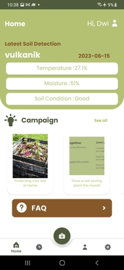

# Soilit: Soil Detection using Machine Learning and Cloud Computing Android Application

Welcome to the Soilit Android application! This project utilizes machine learning and cloud computing to detect soil properties and provide analysis on Android devices.

## Overview

Soilit is an Android application designed to help users analyze soil properties using machine learning algorithms and cloud computing. The application allows users to capture soil images using their smartphone's camera and provides instant analysis and insights about the soil composition, fertility, moisture content, and more.

## Features

- Soil image capture using the smartphone's camera.
- Machine learning algorithms for soil analysis.
- Cloud computing for data processing and analysis.
- Real-time soil property results and recommendations.
- User-friendly interface and intuitive design.

## Screenshots

## Installation

1. Clone the repository: `git clone https://github.com/SoilIt/Mobile-Application`
2. Open the project in Android Studio.
3. Build and run the application on an Android device or emulator.

## Usage

1. Launch the Soilit application on your Android device.
2. Capture a soil image using the in-app camera feature.
3. Wait for the machine learning and cloud computing algorithms to process the image.
4. View the results, including soil composition, fertility, and moisture content.
5. Explore additional features and recommendations provided by the application.

## Technologies Used

- Android Studio: The official IDE for Android application development.
- Kotlin: The programming language used for developing the application.
- Machine Learning Libraries: TensorFlow, scikit-learn, or any other libraries used for training and deploying the soil analysis models.
- Cloud Computing: Google Cloud Platform (GCP), or any other cloud services used for data processing and analysis.

## Contributing

We welcome contributions to the Soilit project! If you would like to contribute, please follow these steps:

1. Fork the repository.
2. Create a new branch: `git checkout -b feature/your-feature`.
3. Make your changes and commit them: `git commit -m 'Add your feature'`.
4. Push to the branch: `git push origin feature/your-feature`.
5. Open a pull request with a detailed description of the changes.

## License

This project is licensed under the [MIT License](LICENSE).

